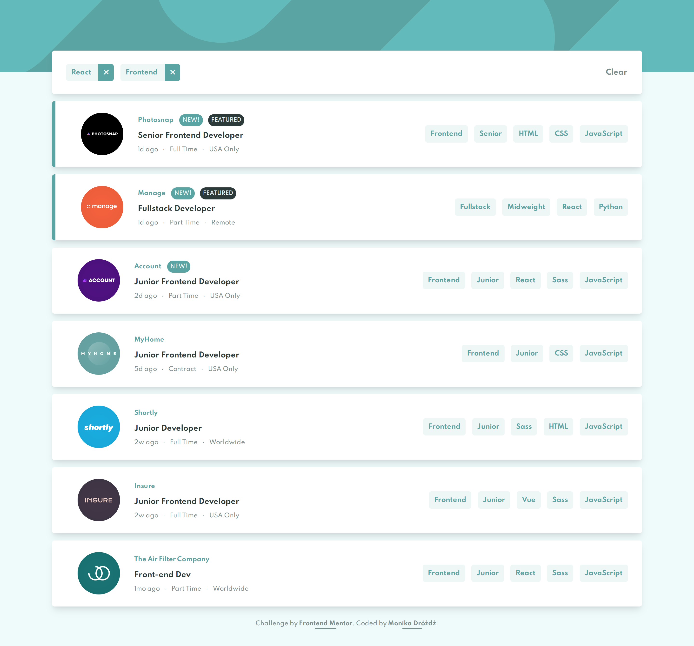

# Frontend Mentor - Job listings with filtering solution with React and SASS

This is a solution to the [Job listings with filtering challenge on Frontend Mentor](https://www.frontendmentor.io/challenges/job-listings-with-filtering-ivstIPCt). 

This project was bootstrapped with [Create React App](https://github.com/facebook/create-react-app).

## Table of contents

- [Overview](#overview)
  - [The challenge](#the-challenge)
  - [Screenshot](#screenshot)
  - [Links](#links)
  - [Prerequisites](#prerequisites)
  - [Installation](#installation)
- [My process](#my-process)
  - [Built with](#built-with)
  - [What I learned](#what-i-learned)
  - [Useful resources](#useful-resources)
- [Author](#author)


## Overview

### The challenge

Users should be able to:

- View the optimal layout for the site depending on their device's screen size
- See hover states for all interactive elements on the page
- Filter job listings based on the categories

### Screenshot



### Links

- Solution URL: [https://github.com/monika-drozdz/Job-listings-with-filtering-solution-built-with-React-and-SASS](https://github.com/monika-drozdz/Job-listings-with-filtering-solution-built-with-React-and-SASS)

### Prerequisites

An adequate version of Node.js is installed. Here's the adequate version I use:

`$ node --version`
`v10.16.0`

An adequate version of npm is installed. Here's the adequate version I use:

`$ npm --version`
`6.9.0`

### Installation

Installation:

`npm install`  

To Run Test Suite:  

`npm test`  

To Start Server:

`npm start`  

To Visit App:

Open [http://localhost:3000](http://localhost:3000) to view it in the browser.

## My process

### Built with

- Semantic HTML5 markup
- [SASS](https://sass-lang.com/)
- Flexbox
- Mobile-first workflow
- [React](https://reactjs.org/) - JS library

### What I learned

Usage of @mixin and @include at-rules in order to re-use chunks of styles:

```scss
@mixin flex($direction, $justify, $align) {
    display: flex;
    flex-direction: $direction;
    justify-content: $justify;
    align-items: $align;
}
```
Usage of built-in Hooks in React such as useState() and useEffect():

```js
function App () {
  const [jobs, setJobs] = useState([]);
  const [filters, setFilters] = useState([]);

  useEffect(() => {
      setJobs(data); 
    }, []
  );
}
```

### Useful resources

- [React documentation](https://reactjs.org/) 
- [Sass documentation](https://sass-lang.com/documentation) 

## Author

- GitHub - [@monika-drozdz](https://github.com/monika-drozdz)
- Frontend Mentor - [@monika-drozdz](https://www.frontendmentor.io/profile/monika-drozdz)


